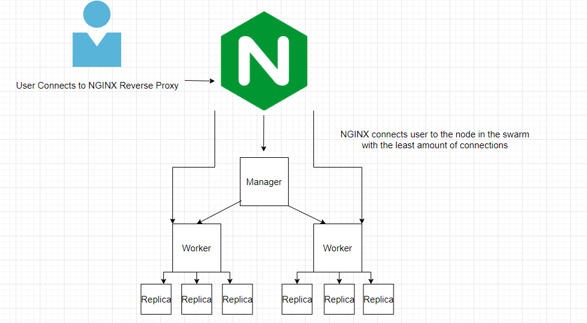

# SFIA2
Practical project for QA academy
## Table of Contents
* [Brief](#brief)
  * [Requirements](#requirements)
    * [Scope](#scope)
    * [Platform Specific](#platform-specific-requirements)
* [Ideas](#ideas)
  * [Documentation]
    * [Risk Assessments](risk-assessments)
    * [Database ED](database-ed)
    * [CI Pipeline](#ci-pipeline)
    * [Abstraction Diagram](abstraction-diagram)
  * [Testing](#testing)
  * [Front-End Design](#front-end-design)
  * [Known Issues](#known-issues)
  * [Future Improvements](#future-improvements)
  

### Brief
 The DevOps Practical project is designed to fully test and showcase my knowledge from the first half of the DevOps course as well as to showcase my ability to operate as a junior/dev-ops engineer. This project focuses more on the CI pipeline than the complexity of the code.
    
 
 #### Requirements
The Minumum Viable Product for this project is a fully complete CI/CD pipeline, integrated into a complete version control system utilising the feature/branch model. The application must be built in a service oriented way, with atleast 4 services being implemented. These are:
 * Service 1: Render templates needed to interact with the application, responsible for communicating with the other 3 services as well as persisting data in an SQL database
 * Service 2+3: Generate a "random" object (Needs 2 implementations)
 * Service 4: Generate an object that is built based on the objects generated previously (Needs 2 implementations)
  

#### Scope
 * An Asana board (or equivalent Kanban board tech) with full expansion on tasks needed to complete the project.
 * An Application fully integrated using the Feature-Branch model into a Version Control System which will subsequently be built through a CI server and deployed to a cloud-based virtual machine.
 * If a change is made to a code base, then Webhooks should be used so that Jenkins recreates and redeploys the changed application
 * The project must follow the Service-oriented architecture that has been asked for.
 * The project must be deployed using containerisation and an orchestration tool.
 * As part of the project, you need to create an Ansible Playbook that will provision the environment that your application needs to run.
 * The project must make use of a reverse proxy to make your application accessible to the user.
    

#### Platform Specific
 * Kanban Board: Asana or an equivalent Kanban Board
 * Version Control: Git
 * CI Server: Jenkins
 * Configuration Management: Ansible
 * Cloud server: GCP virtual machines
 * Containerisation: Docker
 * Orchestration Tool: Docker Swarm
 * Reverse Proxy: NGINX
   

### Ideas
The brief provided for this project provided several example ideas which could be used.
 * Fortune telling app - Generate a random fortune from a set of pre-defined random outcomes.
 * RPG style character generating app - Generate a random class and random attributes from a set of pre-defined random outcomes
 * football betting odds calculator app - Generate a random outcome from a game between 2 clubs from a list of clubs, outcome is decided by random outcomes and pre-defined values.
#### Chosen Idea: Fortune telling app
On refreshing the page the user is shown a series of objects that have been generated using various services, with the following structure:

Service 1: Jinja two template which takes in the values generated by the other 3 services and displays it to the user, hosted using an NGINX reverse proxy. Also makes use of a managed SQL database instance to save the fortune to a database and also display the last 5 (including the current) fortunes to the user. The use of an NGINX reverse proxy provides an extra layer of abstraction between the user and the various services. This means that the user is only connecting to the IP of the nginx instance, and at no point is able to access or interact with the other instances used within the process, such as the workers or manager from the swarm. In addition to providing an extra layer of abstraction, NGINX also is able to act as a load balancer for the swarm, meaning that the service can be almost seamlessly expanded or shrunk depending on the demand the service is experiencing.
  
Service 2 Implementation one: Generates a random day within the year (2021) that will be "lucky" for the user. Using conditional statements to ensure the date is logical.

Service 2 Implementation two: Generates a random month within the next 12 years that will be "lucky" for the user.

Service 3 Implementation one: Generates a luck value from 1-100, with the higher being the more "desirable" outcome.

Service 3 Implentation two: Generates an outcome based on a simulated double dice roll. If the user rolls two of the same number they are classed as lucky and "true" is returned, if not "false" is returned.

Service 4 Implementation one: Checks what the day and luck values are, if the day is in an array of lucky values the luck number is added to, if the day is classed as unlucky the luck value is taken from. This service then generates a fortune message, with the luck number directly influencing how good or bad the fortune is.

Service 4 Implemntation two: Checks what the year value is and also if the user was lucky or not. depending on if the year is in the list of lucky or unlucky years their fortune will change, with various combinations existing.

### Planning
As this is a DevOps style oriented project the various project planning tools and methodologies were adhered to. This meant that the MVP was delivered within a single sprint and that the projects various tasks were displayed and taken from a kanban style board, using trello. The benefit of using a kanban style board is the ability to pick and choose which tasks need to be finished, and to order tasks into specific sections depending on the current state of the task. The full trello board for the project can be seen [here](https://trello.com/b/ArpN6Gwl "Project tracking board")

### Risk Assessments
#### Risk Assessment before
A simple web app like the one developed for this project carries little risk for users and the manager of the app themselves, this is because at no point is the user having to enter data to be input into the database, which eliminates any kind of data breach risk or sensitive information being leaked. In addition to this, the database is being used to store basic data that has very little to no impact on the user. As such the main risks for this project are all related to the CI pipeline/the project manager. Below the initial risk assessment for the project can be seen.

#### Risk Assessment after
After completing the development side of the project a few more risks were identified, mainly relating to the experience that the project leader gained with version control and it's various intricacies, in particular the manual aspect of version control. The full risk assessment can be seen [here](https://docs.google.com/spreadsheets/d/1aVulBmRKDMrYi-YuvX-8LV8_TsfBZZvLFNmAPMKUk24/edit?usp=sharing)

### Database ED
The database is extremely simple and stores the data in two seperate tables which do not need to share a relationship for each app version, which are called Fortune and Fortune2, this is required since the different implementations make use of different contexts, such as day/month and fortune, and month+year/luck and fortune.

### CI Pipeline Before

Before automation was introduced to the project the process from development to the live environment was very manual and tedious, with a CI pipeline the process of getting tasks, pulling from the repo and coding solutions is largely the same, however without a CI pipeline all other set-up has to be manual, this includes testing, containerising, building, pushing and then deploying the app, and this will only deploy it to a single virtual machine without the use of other tools. If a user was able to connect to this single node it could likely bring great risks to the VM, and to access the app the user has to directly interface with this solo VM. The above image illustrates how each process without using a build server is practically manual, this means instead of developing solutions the developer is having to constantly do the same thing over and over again themselves, test, containerise, build, etc.
### CI Pipeline After/Jenkinsfile

After integrating the build server Jenkins and utilizing a configuration management tool the app is able to be automatically tested, containerised, built and deployed to any number of virtual machines, and with the use of nginx as a reverse proxy the user is completely abstracted from the process. This means that the developer has more time to develop features and solutions, and that possible users of the app should have no way to directly interface with the important VMs.

This is achieved through the use of a Jenkins pipeline job that is connected to the github repository directly, and activated using an automated github webhook. Once the pipeline is started the build server searches for a file known as a Jenkinsfile. The Jenkins file is able to set environment variables which are utilized within the repository. It is also able to run shell commands in a cascading order. The Jenkinsfile for this project first sets the environment variables, then tests the application, using a test script which initializes a virtual environment and runs pytest (This stage generates a coverage report due to the inclusion of the cobertura plugin within Jenkins).

The Jenkinsfile also allows the user to reference secure credentials which are attached to the Jenkins instance, meaning that all secret credentials are abstracted even from other developers, It is also impossible to view the previous value of a jenkins credential to my knowledge.

Once the app has been tested the next stage of the jenkinsfile runs docker-compose build --parallel and docker-compose push. This builds the images and pushes them to the user's dockerhub repository, passing through a build version argument to distinguish between the two versions and which images to build.

Once built and pushed the next step for the jenkins file is to run the ansible playbook which is found within the main file structure. This ansible playbook configures the IPs found in the inventory file with the various roles which they require, and then runs the tasks which are defined in the role's main.yaml files. This essentially configures NGINX for the NGINX instance, installs docker and initialises the swarm for the manager instance, and installs docker and joins the swarm for the worker isntances.

Once the playbook has ran and all environments are configured, the final step of the Jenkinsfile is to run a deploy script, which securely copies the compose yaml file and then ssh's into the manager node to deploy the stack, completing the pipeline and deploying the version of the app.
#### Abstraction Diagram

The user is never directly connected to the main driving forces of the app, they are only able to access the NGINX IP, this NGINX IP essentially balances the load of users between the various replicas that the swarm-workers are hosting in a way which prevents one of the worker/replicas being over used.
### Testing

The application has been tested using unit testing and unit test mocking (using patch and other methods) to achieve a coverage of 100% across both implementations, though the coverage reports provide misleading numbers. To achieve 100% coverage a combination of unit testing and unit test mocking had to be used. This is because each service either used HTTP GET requests, HTTP POST requests, or a combination of both, in addition to services 2,3 and 4 making use of the random function.

In order to test service 1 a test database was used, and mock information was inputted as part of the SetUp of the TestBase. to test the HTTP requests the requests_mock function was used to allow multiple get requests and a post request to be mocked at the same time, with sample information. From there assertions were made that the data inputted was present on the page.

To test service 2 and 3 assertions were used in combination with the patch function, this meant that the random functions were forced to return the specified value. Finally service4 was tested using simple assertions that were used with self.client.post.

It is worth noting that at this sprint stage for the MVP, Integration testing with selenium has not been implemented. This is due to the fact that the front-end has no interactable buttons or user inputs aside from the navigation menu, which essentially is the refresh button, a default function for the browser that runs the functions for the app on load or "GET" of the index page.

Another benefit of using a jenkins pipeline to deploy the app is that jenkins provides their users with real-time performance metrics for each stage, which makes it easier to see when improvements or regressions have been made in relation to the app and it's deployment time.
### Front-end design

The front end of the application is extremely simple and combined html with rudimentary CSS to center the text, provide spacing and alter the heading colour. This combination of HTML and CSS means that the user is provided with all necessary information in a digestible format.
#### Known Issues
As of current the only known issue is that when the rolling update is performed, the app produces a variety of SQL alchemy errors, which is due to each implementation using a different database table, and such each different version references a different model within it's files.
### Future Improvements
As the app is very simple by nature there are a number of improvements which could be made to it and the CI pipeline, including but not limited to:
 * Adding some form of user input to generate the fortune, such as a form or button. This would make the app more interactive and likely more usable, since not everyone would refresh the page to generate a new feature. If this user input is added, integration testing would need to be performed at 100% coverage before redoploying the build.
 * Expanding the content of service 3 and 4 to provide a more replayable experience from the perspective of a user.
 * Have the outcome of service 3 be determined by user input rather than randomly generated, so a user interacts with a game like a dice game or something similar.
 * Expanding the amount of worker nodes to 3 or 4 from 1 to ensure that the app and reverse proxy has very little chance of producing an error/ being inaccessble.
 * There is currently a slight downtime when the new version of the app is deployed, which produces various errors visible to the users in the time the deployment stage takes (Roughly 10s), until all containers and replicas have recieved the new version of the app. It would be ideal to reduce this downtime to as close to zero as possible.
 
#### Author
Brendan Kirkby
#### Acknowledgements
 * Harry Volker- Guidance throughout the project, provided the base for many files and folder structures, Help troubleshooting issues and with version control intracacies. Github can be found [here](https://github.com/htr-volker)

